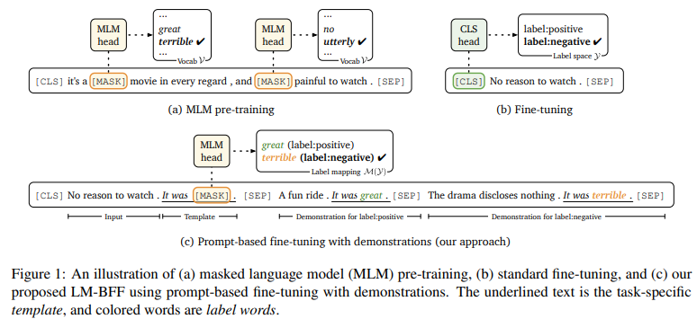
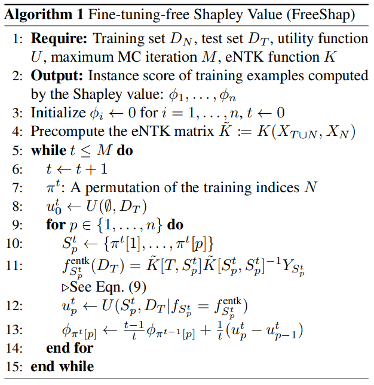
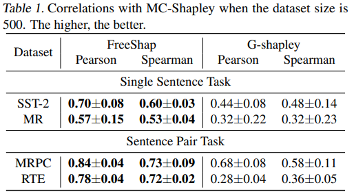
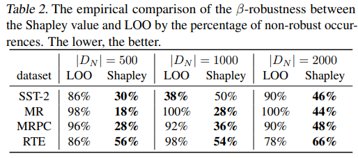
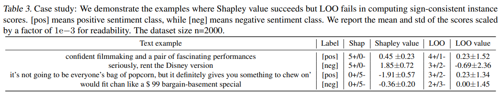
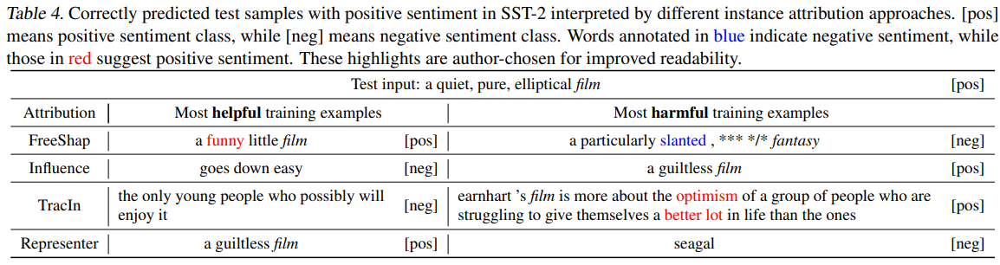
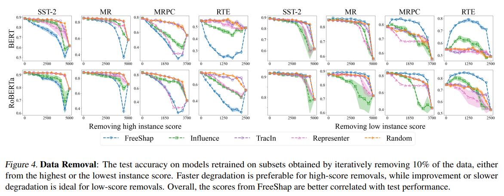
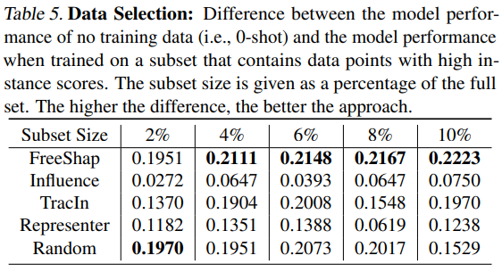
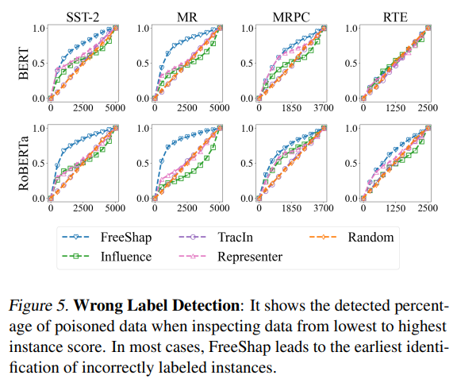

## [Helpful or Harmful Data? Fine-tuning-free Shapley Attribution for Explaining Language Model Predictions](https://arxiv.org/html/2406.04606v1)
 
### Summary 

### Abstract
1. instance attribution(학습 데이터의 모델 예측에 대한 영향도를 산출하는 것)에 집중하여 foundation model의 explainability에 대한 필요성을 제언
2. instance 점수의 강건성 이슈; 리샘플링 시 gap 발생 $\rightarrow$ instance 점수의 부호에 기반하여 새로운 강건성 측정 지표를 제안
3. 전통적인 leave-one-out 방법은 강건성 측면에서 부족
   Shapley 값은 비용이 높으나(computationally expensive) 더 좋은 성능을 보임
4. LLM에 적용가능하고 데이터 제거, 오라벨 탐지 등의 data-centric application에 효율적인 근사 방법 제안(FreeShap) 

### Motivation
- 딥러닝 모델의 산출물에 대한 explainability(특히 헬스케어, 금융 분야)
- explainability에 대한 솔루션으로 instance attribution이 있음
- instance score의 신뢰도 보장을 위해서는 데이터 샘플이 달라져도 score에 대한 일관성(특히 부호)을 유지하는 것이 중요

### Contribution
- 새로운 강건성 개념을 제안 
  샘플링된 데이터 간 일관성있는 sign score를 유지하는지를 기반으로 instance attribution의 강건성을 확인; 기존 방법들은 perturbation(input에 대한 미세한 변경) 기반으로 모델의 강건성을 확인
- FreeShap; fine-tuning-free Shapley 값 근사 방법을 제안 
  - instance attribution의 강건성을 향상시킬 수 있는 neural tangent kernel 기반의 방법
  - 프롬프트 기반의 fine-tuning으로 효율적이고 효과적인 instance attribution을 수행; computational cost 절감

### Preliminaries
- [Shapley value](https://christophm.github.io/interpretable-ml-book/shapley.html): 게임이론을 기반으로, 특정한 feature에 대한 영향도 산출을 위해 여러 feature들의 조합을 구성하여 대상 feature의 유무에 따른 평균적인 변화 수치화한 값
- $D_N := {z_i=(x_i, y_i)}^n_{i=1}$: training set 
- $D_T := {z_i=(x_i, y_i)}^{n+m}_{i=n+1}$: test set 
  - input $x_i in \mathcal{X}$ & the label $y_i \in [\mathcal{C}]$ is a data point sampled from a data distribution $\mathcal{P}$ 
- attribution fuction $g(z_i, D_T, D_N)$: $z_i$가 $D_T$의 예측 결과에 미치는 영향을 정량화하는 함수
- utility for a subset $D_S:=U_{j \in S} \{ z_j \in D_N \}$ of $D_N$: test accuracy on $D_T$ of its resultant model $f_s$ parameterized by $\theta$
$$
U(S, D_T) := \frac{1}{|D_T|}\Sigma_{(x_t, y_t) \in D_T} \bf{1}[f_s(x_t;\theta)=y_t]
$$

#### prompt-based fine-tuning[1](pbft)
  - 본 연구에서는 prompt-based fine-tuning에 집중하여 논의 

  

    
  

  pre-training된 MLM(masked language model)을 가지고 감성 분석 모델을 fine-tuning하는 상황을 가정해보겠습니다. 
  pre-training 과정에서는 문장의 일부를 [MASK] 토큰으로 치환하고 이를 예측하는 task(masked token prediction)를 통해 language model을 학습시킵니다. 그리고 감성 분석을 위해 fine-tuning하는 과정에서는 ("문장", "라벨")로 구성된 데이터셋을 이용해 task-specific head를 훈련합니다. 
  반면, prompt-based fine-tuning은 감성 분석을 MLM task로서 접근하는 방식입니다.
  ("문장", "라벨") 형태의 데이터셋을 이용해 학습을 진행하되, "라벨"이 [MASK] 토큰을 포함한 문장 형태입니다(ex. [CLS] $x_1$ It was [MASK]. [SEP]). 모델은 $x_1$의 감성과 부합하는, [MASK]에 들어갈 적절한 단어를 예측하도록 훈련합니다. 더불어, [MASK]의 hidden vector를 이용하여 [MASK]에 들어갈 단어가 각 분류군(ex. 긍정/부정)에 속할 확률을 계산합니다.   

#### LOO(leave-one-out) & Shapley Value for Instance Attribution         
  - $\Delta_{z_i}^{D_N}(k, D_T)$: data point $z_i$에 대해, 이를 제외한 학습 데이터에서 가능한 모든 경우로 $k$개의 샘플 데이터를 구성하였을 때, 이에 대한 marginal contribution
  $$
  \Delta_{z_i}^{D_N}(k, D_T) := \frac{1}{\binom {n-1}k} \Sigma_{S \subseteq N\backslash\{i\}, |S|=k}U(S\cup \{i\}, D_T) - U(S, D_T)
  $$
  - marginal contribution: 단일 변수나 요인이 결과에 영향을 미치는 정도
  - LOO: $z_i$의 $D_N \backslash \{z_i\}$에 대한 marginal contribution을 통해 특정 data point를 제거함으로써 모델 정확도에 일어나는 변화를 관찰 
    - instance scoring function 
      $$
        g^{LOO}(z_i, D_T, D_N) = \Delta_{z_i}^{D_N}(n-1, D_T)
      $$

  - Shapley Value: 모든 subset에서의 $z_i$의 영향도를 관찰
    - instance scoring function 
      $$
        g^{Shap}(z_i, D_T, D_N) = n^{-1}\Sigma_{k=0}^{n-1}\Delta_{z_i}^{D_N}(k, D_T)
      $$
      모든 subset에 대한 $z_i$의 marginal contribution의 평균값
      다만, computational cost가 높음 (학습 데이터의 크기가 $n$이라면, $n!$의 연산이 필요)

#### Neural Tangent Kernel(NTK)
infinite-width의 신경망에 대한 training dynamic을 연구하기 위해 제안된 이론으로 active learning 등의 응용으로 확장 

fully connected & sufficiently wide한 신경망을 훈련시키는 것 $\simeq$ solving kernel regression with the NTK at random initialization

- NTK의 이론을 language model fine-tuning에 적용하는 부분에서의 challange
  1. random initialization 대신 pretrained weight를 사용하는 것 
  2. 프롬프트의 사용
  
  $\rightarrow$ pretrained weight으로부터 계산된 empirical NTK를 이용하여 kernel regression을 푸는 것은 prompt-based fine-tuning과 유사한 측면이 있음 

  더불어, eNTK를 이용한 kernel regression은 CV, NLP 분야에서 fine-tuning과 유사한 성능을 보인 바 있음; 즉, fine-tuning의 대안으로 활용될 수 있음 

- eNTK regression model on test input $x_t$
$$
f^{entk}_S(x_t) = K(x_t, X_S)^\mathsf{T}K(X_S, X_S)^{-1}Y_S,
$$
  where 
  - $\psi(x_i) := \frac{\partial{f(x_i; \theta_0)}}{\partial{\theta_0}} \in \mathbb{R}^{C \times P}$; $\theta_0 \in \mathbb{R}^P$ consists of the pretrained weights
  - $X_S := [x_1 \ldots x_k]^\mathsf{T}]$; input matrix
  - $Y_S := [y_1^1 \ldots y_C^k]^\mathsf{T}] \in \{0, 1 \}^{kC}$
  - $K(x_t, X_S) = [\psi(x_t)\psi(x_i)^\mathsf{T}]^k_{i=1} \in \mathbb{R}^{k\mathcal{C}\times\mathcal{C}}$
  - $K(X_S, X_S) = [\psi(x_i)\psi(x_j)^\mathsf{T} ]^k_{i,j=1} \in \mathbb{R}^{k\mathcal{C}\times k\mathcal{C}}$

### Main Idea
1. Robustness에 대한 정의 
    - $D_N \sim \mathcal{P}^{n-1} | z_i$ := $z_i$는 고정, (n-1)개의 data point는 $\mathcal{P}$에서 i.i.d. 하게 샘플링 한 데이터셋
    - $\tau_k := \mathbb{E}_{D_N \sim \mathcal{P}^{n-1} | z_i } [\Delta_{z_i}^{D_N}(k, D_{\mathsf{T}})]$; expected marginal contribution of $z_i$ to the subsets of $D_N$
    - $z_i$ is **consistently helpful**(resp. **consistently harmful**) to test set $D_{\mathsf{T}}$ if $\tau_k \ge 0$(resp. $\tau_k < 0$) $\forall k \ge \{0, \ldots, n-1 \}$ 
      - $z_i$ is **consistently harmful** = $z_i$를 포함하는 데이터셋은 모델 성능을 저하시킬 위험이 있다 $\rightarrow$ instance score of $z_i$ < 0
      
      그러나, 샘플링 시, 랜덤하게 데이터셋을 잡기 때문에, attribution score는 non-negative일 수 있음

      $\therefore$ 동반하는 데이터에 무관하게, 데이터의 유효성을 일관성있게 확인할 수 있는 scheme이 필요함
    
    - **Robustness of instance attribution**
  
      For a consistenly harmful (resp. helpful) point $z_i$, $sgn^*(z_i) = -1$ (resp. $sgn^*(z_i) = 1$).
      
      instance attribution approach **$\beta$-robust** in giving instance score for $z_i$ if 
      $$
        \mathbb{P}_{D_N \sim \mathcal{P}^{n-1} | z_i } \left ( sgn \left(g(z_i, D_{\mathsf T}D_N)\right) \ne sgn^*(z_i) \right) = \beta
      $$ 

      즉, $z_i$에 대해, instance attribution scheme이 $\beta$-robust 하다 = 리샘플링 시, instance score의 부호가 반전될 확률이 $\beta$이다. 혹은, 동일한 분포를 갖는 데이터에서 샘플링을 수행할 때, sign-consistency를 보장한다 =  $\beta$를 작게 유지한다

  
2. Robustness of Instance Attribution
  - Thm 3.4 (Robustness for Shapley value & LOO)  
    Let $\delta_k$ := $Var_{D_N \sim \mathcal{P}^{n-1}|z_i}(\Delta_{z_i}^{D_N}(k, D_T)), \forall k \in \{0, \ldots, n-1\}$.  
    Shapley value is $\beta^{Shap}$-robust and LOO is $\beta^{LOO}$-robust, where 
    $$
    \beta^{Shap} \le \frac{n^{-1}\Sigma_{k=0}^{n-1}\delta_k}{(n^{-1}\Sigma_{k=0}^{n-1}\tau_k)^2} \text{ and } \beta^{LOO} \le \frac{\delta_{n-1}}{\tau^2_{n-1}}
    $$

  - Cor 3.5 (Robustness Analysis between the Shapley value & LOO)  
    Assume that $n^{-1} \Sigma_{k=0}^{n-1} \delta_k \le \delta_{n-1}$. For any consistently harmful (or helpful) contributing data point $z_i$, assume $|\tau_0| \ge \cdots \ge |\tau_{n-1}|$. Then 
    $$
    \frac{n^{-1}\Sigma_{k=0}^{n-1}\delta_k}{(n^{-1}\Sigma_{k=0}^{n-1}\tau_k)^2} \le \frac{\delta_{n-1}}{\tau^2_{n-1}}
    $$
    $\rightarrow \beta^{Shap}$의 상한 $\le \beta^{LOO}$의 상한  
    $\rightarrow$ 상한이 더 높다 = sign-inconsistent 한 점수를 줄 수 있다  
    $\rightarrow$ Shapley가 더 robust 하다

  - Remark 3.6 (Relative relationship of expectation and variance between Shapley & LOO)  
    Shapley value는 LOO에 비하여 기댓값의 magnitude가 크고 분산이 적음  
    $\rightarrow$ consistently helpful data point에 대하여, Shapley value는 0 근처에서 fluctuate할 확률이 적음

3. Fine-tuning-free Shapley Value (FreeShap)  
  Shapley value의 계산은 marginal contribution 계산을 필요로 함.  $S$의 모든 subset에 대하여 모델을 재학습해야하므로 exponential times 만큼의 fine-tuning이 필요. 이전 연구들은 Monte-Carlo 샘플링을 이용하여 exponential time에서 polynomial time으로 계산량을 줄였으나, 여전히 fine-tuning cost가 큼 (LM을 fine-tuning하는 것 자체도 costly 하므로).  
  FreeShap에서는 eNTK에 대하여 kernel regression을 적용하여 utility function을 효율적으로 계산하고자 함으로써 Shapley value 계산에 대한 scalability를 개선하고자 함  
  

    
  

### Experiment Result
- Dataset: Stanford Sentiment Treebank v2(SST-2), Rotten Tomatoes Movie Review(MR), Microsoft Research Paraphrase Corpus(MRPC), Recognizing Textual Entailment(RTE)
- Model: BERT 

1. FreeShap Approximates the Shapley Value Well  
  marginal contribution을 계산할 때 prompt-based fine-tuning을 사용
  500개의 학습 데이터를 랜덤하게 샘플링한 후, 50개의 random 데이터 포인트에 대하여 FreeShap와 gradient Shapley(G-Shapley) value를 구한 후 MC Shapley value와의 유사도를 측정  
   - FreeShap이 더 높은 유사도를 보임 $\rightarrow$ Shapley value를 더 잘 근사함
  

    
  

  
  
2. The Shapley Value is More Robust than LOO  
  distribution이 동일한 별개의 데이터에 대한 instance score 부호의 일관성을 평가  
   
  

      
  

3. Applications of Instance Attribution
  - Shapley value는 $\pm$ 시에도 부호가 유지되는 모습
    

        
    

  - FreeShap이 의미론적으로 결과에 helpful, harmful한 example을 더 잘 찾는 모습
    

        
    

  - instance score가 높은 데이터를 배제하는 경우, FreeShap은 더 faster한 degradation을 보임. 반대로 instance score가 낮은 데이터를 제거하는 경우, 타 방법들보다 FreeShap이 slower한 degradation을 보임
    

        
    

  - FreeShap이 경우가 모델 성능 향상의 폭이 제일 큼
    

        
    

  - FreeShap의 경우가 성능 향상의 폭이 제일 큼
    

        
    

### Limitation
- NLP 도메인 및 분류 task에 한정된 연구결과

### 참고문헌
<a name="pbft">1</a> : [Making Pre-trained Language Models Better Few-shot Learners](https://aclanthology.org/2021.acl-long.295.pdf)  
shapley value: https://datanetworkanalysis.github.io/2019/12/23/shap1
